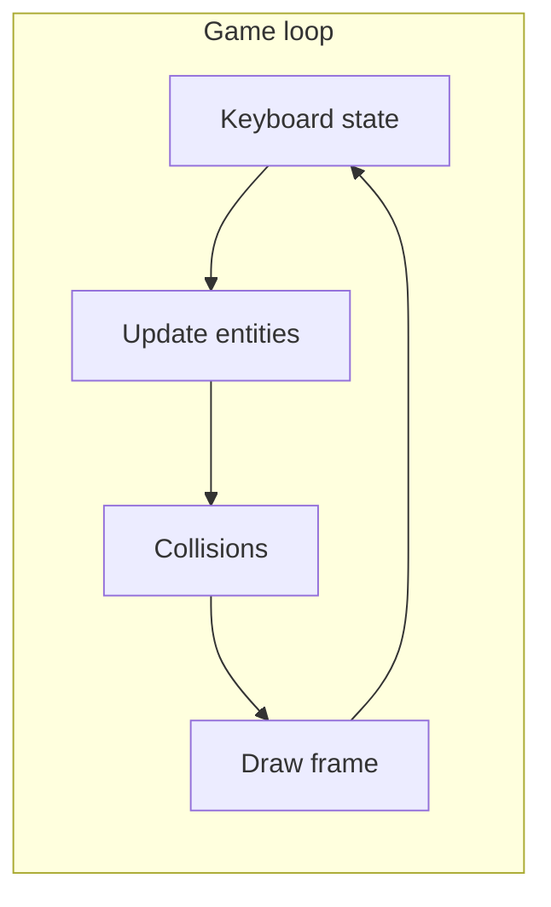

# Space Invaders (basic web tech)

## Technology choice (JavaScript vs Python vs others)

Your original direction was **basic web tech**: the game runs **in the browser**. That strongly favors **JavaScript** (or a compile-to-JS language) on the **client**.

| Approach | Pros | Cons | Fit for this project |
|----------|------|------|----------------------|
| **Vanilla JavaScript + HTML5 Canvas + CSS** | Native browser APIs (`requestAnimationFrame`, canvas 2D); **no build step**; static files only—open `index.html` or any static host; trivial to share and deploy; huge docs/tutorials | No compile-time types (unless you add TS); manual structure for large codebases | **Best default**: matches “basic web,” tight loop, easy hosting |
| **TypeScript** (+ same canvas stack) | Types catch bugs as game logic grows; better IDE support | Needs **build step** (`tsc`, Vite, etc.) or careful Deno setup—more tooling than “plain web files” | Good **optional upgrade** if you want types without a heavy engine |
| **Python + Pygame** (or `arcade`) | Familiar if you prefer Python; fast local desktop play | **Not a web app** by default—users need Python or a packaged binary; **Web** export (e.g. specialized WASM pipelines) is extra complexity | Choose if goal is **learn Python / desktop**, not “open in browser” |
| **Python backend only** (Flask/FastAPI serving HTML/JS) | Nice for teaching HTTP or future leaderboards | The **game still runs in JS in the browser** unless you embed **PyScript**—Python does not replace client graphics for a responsive arcade loop | Use Python **only if** you explicitly want a server (scores API, multiplayer later); game client stays JS |
| **PyScript / Brython** (Python in the tab) | Write Python syntax that runs in WASM/JS | **Heavier load**, less common for canvas games, weaker ecosystem vs JS for rAF/canvas examples | Usually **worse** than JS for this scope |
| **Game engines** (Godot HTML5, Unity WebGL, etc.) | Editor, tooling, export pipelines | Overkill for Space Invaders; larger bundles; not “minimal web tech” | Skip unless you already standardize on an engine |

**Recommendation for this app:** **JavaScript (vanilla)** in the browser with **Canvas 2D**, plus **CSS** for layout/HUD chrome. Add **TypeScript** only if you explicitly want types and accept a small toolchain. Use **Python** when the goal shifts to **desktop Pygame** or a **server-backed** web app—not as the primary language for a minimal in-browser canvas game.

## Stack and constraints (chosen path)

- **HTML5 Canvas** for all drawing (ships, aliens, bullets, shields). Keeps rendering fast and matches classic arcade feel.
- **Vanilla JavaScript** (ES modules optional: single `game.js` or `js/` split by concern). No React, bundler, or npm required for the core deliverable.
- **CSS** for layout (centered game container, optional scanline/crt-ish styling), not for game sprites.

## Research-backed look and feel (sources: [Wikipedia — Space Invaders](https://en.wikipedia.org/wiki/Space_Invaders), [Space Invaders — Computer Archaeology](https://www.computerarcheology.com/Arcade/SpaceInvaders/), [Space Invaders — Shmups Wiki](https://shmups.wiki/library/Space_Invaders))

The **first version of this plan did not use web research**; this section reflects follow-up checks so implementation can look and behave closer to the 1978 arcade game.

### Visual identity

- **Playfield**: **Black** “space” background; **raster / chunky pixel** aliens (distinct **squid, crab, and octopus**-style silhouettes), **two-frame walk animation** per type.
- **Original cabinets** often used a **black-and-white CRT** with **orange/green cellophane strips** over regions of the screen to fake color zones—later cabinets used real color. For the web clone, approximate this with a **simple palette**: bright green/cyan ship and shots, magenta or white aliens, green bunkers—or use subtle horizontal **color bands** in CSS behind the canvas to nod to the overlay effect without copying cabinet art.
- **HUD**: Classic layout keeps **score (and high score)** at the **top**, **lives / credits** near the **bottom** or corners—mirroring “stats above and below the playing field” descriptions in Wikipedia.
- **Laser base** (player): wide **tank/cannon** silhouette at **bottom center**; aliens in a **block** in the upper half; **four bunkers** between player and aliens.

### Arcade-accurate mechanics worth mirroring (even in a “basic” clone)

| Topic | Authentic behavior (summarized) |
|-------|----------------------------------|
| Grid | **5 rows × 11 columns** = **55** invaders; whole **formation moves**, **drops a step** at screen edge, reverses horizontal direction. |
| Scoring | Three alien types × points: commonly **30 / 20 / 10** from **bottom row to top** (bottom “large” worth most in many descriptions—align row-to-points with chosen sprites). |
| Difficulty ramp | Movement (and classic “heartbeat” sound pace) **speeds up as fewer aliens remain**—originally partly a hardware side effect, kept as core tension. |
| Player fire | Arcade: **only one player shot on screen at a time** (strongly characteristic; good “authentic easy mode” flag). |
| Bunkers | **Four** shields; **eat away** from hits; player shots from **directly underneath** can **carve the bottom** of a bunker (friendly fire on cover). |
| Mystery ship | Periodically crosses **top** of screen; bonus score (arcade used a **deterministic score table** tied to shot timing—implement later as stretch, or simple random 50–300 for MVP). |

### Implementation tips from retro / dev discussions

- **Collision**: Axis-aligned boxes are enough; for bunkers use a **grid of destructible cells** or small rects for “chunky” erosion.
- **Alien bombs**: Original alien fire is **pattern-based**, not purely random—start with **timed drops from random bottom-row aliens**, refine later.
- **Audio**: **Web Audio API** beeps for move thump, player shoot, alien destroyed, UFO—**no asset files** required.
- **Reference play**: Short YouTube longplays or MAME footage help **tune spacing**, **drop distance**, and **speed curve** when balancing.

## File layout (recommended)

| File | Role |
|------|------|
| [index.html](/home/michal-stasiak/Cursor/training_game/index.html) | Canvas element, score/lives UI hooks, script tags |
| [styles.css](/home/michal-stasiak/Cursor/training_game/styles.css) | Page + `#game` sizing, fonts, optional retro UI |
| [game.js](/home/michal-stasiak/Cursor/training_game/game.js) | Game loop, entities, input, collisions (or split `entities.js` / `input.js` if you prefer ~300+ lines in one file to stay readable) |

Optional: `README.md` with `python3 -m http.server` only if you want documented launch steps (you did not request docs; launch can be noted inline or verbally).

## Core gameplay (MVP)

1. **Player**: horizontal movement within bounds; **Space** to shoot; enforce **single shot on screen** (arcade-true) or a short cooldown if you prefer a softer modern feel.
2. **Aliens**: **5×11** grid moving as a block—shift horizontally until an edge is hit, then **step down** and reverse direction; **game over** if invaders reach the **bottom** (player line). **Increase horizontal speed** (and optionally drop cadence) as the count decreases.
3. **Bullets**: player shots upward; **alien bombs** downward. Simple **AABB** collision vs aliens, player, bunkers.
4. **Shields**: **four** destructible bunkers; erosion from both sides; allow **player shots** to damage bunker bottoms when firing from underneath.
5. **Scoring**: **30 / 20 / 10** points by row tier (map consistently to the three sprite types); **score + lives** in HUD; optional **extra life** at a fixed score (arcade used bonuses like extra cannon at point thresholds—optional).

## Architecture (concise)

- **`requestAnimationFrame`** loop with **fixed dt** or delta-time clamped to avoid spiral of death after tab blur.
- **Input**: `keydown`/`keyup` map (e.g. `ArrowLeft`, `ArrowRight`, `Space`) with `preventDefault` for Space where needed.
- **State**: enum or string for `menu | playing | gameOver | win` (win = all aliens cleared). Optional quick **restart** (Enter / R).

## Implementation details worth deciding up front

- **Coordinate system**: logical size (e.g. 480×640) scaled to CSS size; optional `devicePixelRatio` scaling for sharp pixels on HiDPI.
- **Alien movement**: store grid origin `(x,y)` + per-alien offset in grid; moving the block updates origin; edge detection uses combined bounding box.
- **Collision**: rectangles for everything MVP; shields as multiple small rects or a coarse grid sampled on hit.

## Stretch (after MVP works)

- **Mystery ship** crossing the top with scoring closer to arcade (timing-based table vs simple random).
- **Alien bomb patterns** closer to original instead of purely random.
- Sound via **Web Audio** oscillators (no asset files), **mute** toggle, and pitch/speed tied to alien count for the classic “heartbeat” tension.

## How you will run it

- **Direct**: open `index.html` in a browser (works for single-file-origin and no ES module edge cases).
- **If using ES modules** (`type="module"`): serve the folder (`python3 -m http.server` or any static server) because `file://` often blocks modules.

## Out of scope (unless you ask)

- Multiplayer, touch controls, persistence (high scores in `localStorage` is a small add-on later).

This plan delivers a **self-contained, classic Space Invaders–style** experience aligned with “basic web tech” and fits an empty repo with three core files plus optional splits for readability.
